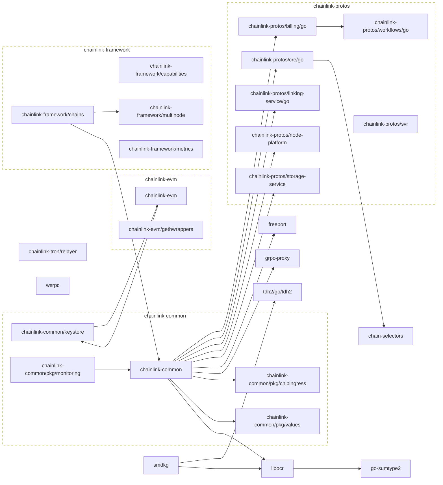

## Common modules and org dependencies

```mermaid
flowchart LR

	chain-selectors
	click chain-selectors href "https://github.com/smartcontractkit/chain-selectors"
	chainlink-common --> chainlink-common/pkg/chipingress
	chainlink-common --> chainlink-common/pkg/values
	chainlink-common --> chainlink-protos/billing/go
	chainlink-common --> chainlink-protos/cre/go
	chainlink-common --> chainlink-protos/linking-service/go
	chainlink-common --> chainlink-protos/node-platform
	chainlink-common --> chainlink-protos/storage-service
	chainlink-common --> freeport
	chainlink-common --> grpc-proxy
	chainlink-common --> libocr
	click chainlink-common href "https://github.com/smartcontractkit/chainlink-common"
	chainlink-common/keystore --> chainlink-evm
	click chainlink-common/keystore href "https://github.com/smartcontractkit/chainlink-common"
	chainlink-common/pkg/chipingress
	click chainlink-common/pkg/chipingress href "https://github.com/smartcontractkit/chainlink-common"
	chainlink-common/pkg/monitoring --> chainlink-common
	click chainlink-common/pkg/monitoring href "https://github.com/smartcontractkit/chainlink-common"
	chainlink-common/pkg/values
	click chainlink-common/pkg/values href "https://github.com/smartcontractkit/chainlink-common"
	chainlink-evm --> chainlink-common/keystore
	click chainlink-evm href "https://github.com/smartcontractkit/chainlink-evm"
	chainlink-evm/gethwrappers
	click chainlink-evm/gethwrappers href "https://github.com/smartcontractkit/chainlink-evm"
	chainlink-framework/capabilities
	click chainlink-framework/capabilities href "https://github.com/smartcontractkit/chainlink-framework"
	chainlink-framework/chains --> chainlink-common
	chainlink-framework/chains --> chainlink-framework/multinode
	click chainlink-framework/chains href "https://github.com/smartcontractkit/chainlink-framework"
	chainlink-framework/metrics
	click chainlink-framework/metrics href "https://github.com/smartcontractkit/chainlink-framework"
	chainlink-framework/multinode
	click chainlink-framework/multinode href "https://github.com/smartcontractkit/chainlink-framework"
	chainlink-protos/billing/go --> chainlink-protos/workflows/go
	click chainlink-protos/billing/go href "https://github.com/smartcontractkit/chainlink-protos"
	chainlink-protos/cre/go --> chain-selectors
	click chainlink-protos/cre/go href "https://github.com/smartcontractkit/chainlink-protos"
	chainlink-protos/linking-service/go
	click chainlink-protos/linking-service/go href "https://github.com/smartcontractkit/chainlink-protos"
	chainlink-protos/node-platform
	click chainlink-protos/node-platform href "https://github.com/smartcontractkit/chainlink-protos"
	chainlink-protos/storage-service
	click chainlink-protos/storage-service href "https://github.com/smartcontractkit/chainlink-protos"
	chainlink-protos/svr
	click chainlink-protos/svr href "https://github.com/smartcontractkit/chainlink-protos"
	chainlink-protos/workflows/go
	click chainlink-protos/workflows/go href "https://github.com/smartcontractkit/chainlink-protos"
	chainlink-tron/relayer
	click chainlink-tron/relayer href "https://github.com/smartcontractkit/chainlink-tron"
	freeport
	click freeport href "https://github.com/smartcontractkit/freeport"
	go-sumtype2
	click go-sumtype2 href "https://github.com/smartcontractkit/go-sumtype2"
	grpc-proxy
	click grpc-proxy href "https://github.com/smartcontractkit/grpc-proxy"
	libocr --> go-sumtype2
	click libocr href "https://github.com/smartcontractkit/libocr"
	smdkg --> libocr
	smdkg --> tdh2/go/tdh2
	click smdkg href "https://github.com/smartcontractkit/smdkg"
	tdh2/go/tdh2
	click tdh2/go/tdh2 href "https://github.com/smartcontractkit/tdh2"
	wsrpc
	click wsrpc href "https://github.com/smartcontractkit/wsrpc"

	subgraph chainlink-common-repo[chainlink-common]
		 chainlink-common
		 chainlink-common/keystore
		 chainlink-common/pkg/chipingress
		 chainlink-common/pkg/monitoring
		 chainlink-common/pkg/values
	end
	click chainlink-common-repo href "https://github.com/smartcontractkit/chainlink-common"

	subgraph chainlink-evm-repo[chainlink-evm]
		 chainlink-evm
		 chainlink-evm/gethwrappers
	end
	click chainlink-evm-repo href "https://github.com/smartcontractkit/chainlink-evm"

	subgraph chainlink-framework-repo[chainlink-framework]
		 chainlink-framework/capabilities
		 chainlink-framework/chains
		 chainlink-framework/metrics
		 chainlink-framework/multinode
	end
	click chainlink-framework-repo href "https://github.com/smartcontractkit/chainlink-framework"

	subgraph chainlink-protos-repo[chainlink-protos]
		 chainlink-protos/billing/go
		 chainlink-protos/cre/go
		 chainlink-protos/linking-service/go
		 chainlink-protos/node-platform
		 chainlink-protos/storage-service
		 chainlink-protos/svr
		 chainlink-protos/workflows/go
	end
	click chainlink-protos-repo href "https://github.com/smartcontractkit/chainlink-protos"

	classDef outline stroke-dasharray:6,fill:none;
	class chainlink-common-repo,chainlink-evm-repo,chainlink-framework-repo,chainlink-protos-repo outline
```
