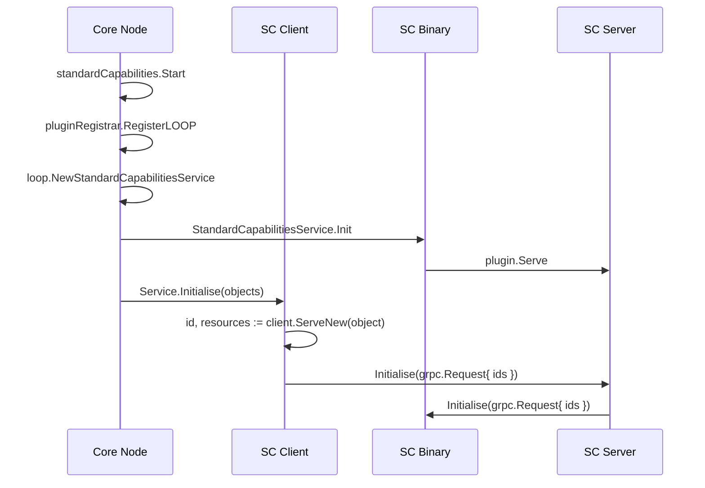

```mermaid
sequenceDiagram
    participant CoreNode as Core Node
    participant SCClient as SC Client
    participant LooppBinary as SC Binary
    participant SCServer as SC Server

    CoreNode->>CoreNode: standardCapabilities.Start
    CoreNode->>CoreNode: pluginRegistrar.RegisterLOOP
    CoreNode->>CoreNode: loop.NewStandardCapabilitiesService
    CoreNode->>LooppBinary: StandardCapabilitiesService.Init
    LooppBinary->>SCServer: plugin.Serve
    CoreNode->>SCClient: Service.Initialise(objects)
    SCClient->>SCClient: id, resources := client.ServeNew(object)
    SCClient->>SCServer: Initialise(grpc.Request{ ids })
    SCServer->>LooppBinary: Initialise(grpc.Request{ ids })
```
