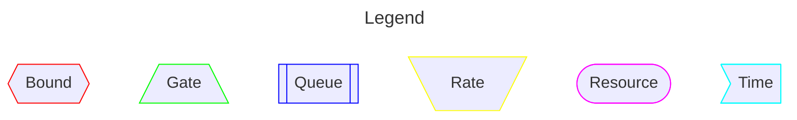
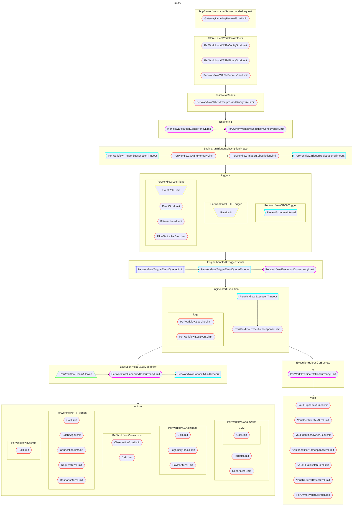

# CRE Settings

```mermaid
---
title: Legend
---
flowchart
    bound{{Bound}}
    gate[/Gate\]
    queue[[Queue]]
    rate[\Rate/]
    resource([Resource])
    time>Time]
    
    bound:::bound
    gate:::gate
    queue:::queue
    rate:::rate
    resource:::resource
    time:::time

    classDef bound stroke:#f00
    classDef gate stroke:#0f0
    classDef queue stroke:#00f
    classDef rate stroke:#ff0
    classDef resource stroke:#f0f
    classDef time stroke:#0ff
```

```mermaid
---
title: Limits
---
flowchart
    subgraph handleRequest[httpServer/websocketServer.handleRequest]
        GatewayIncomingPayloadSizeLimit{{GatewayIncomingPayloadSizeLimit}}:::bound
    end
%%    WorkflowLimit - Deprecated
%%    TODO unused
%%    PerOrg.ZeroBalancePruningTimeout

    subgraph Store.FetchWorkflowArtifacts
        PerWorkflow.WASMConfigSizeLimit{{PerWorkflow.WASMConfigSizeLimit}}:::bound
        PerWorkflow.WASMBinarySizeLimit{{PerWorkflow.WASMBinarySizeLimit}}:::bound
        PerWorkflow.WASMSecretsSizeLimit{{PerWorkflow.WASMSecretsSizeLimit}}:::bound
    end

    subgraph host.NewModule
        PerWorkflow.WASMCompressedBinarySizeLimit{{PerWorkflow.WASMCompressedBinarySizeLimit}}:::bound
    end
    
    subgraph Engine.init
        WorkflowExecutionConcurrencyLimit([WorkflowExecutionConcurrencyLimit]):::resource
        PerOwner.WorkflowExecutionConcurrencyLimit([PerOwner.WorkflowExecutionConcurrencyLimit]):::resource

        WorkflowExecutionConcurrencyLimit-->PerOwner.WorkflowExecutionConcurrencyLimit
    end
    
    subgraph Engine.runTriggerSubscriptionPhase

        PerWorkflow.TriggerSubscriptionTimeout>PerWorkflow.TriggerSubscriptionTimeout]:::time
        PerWorkflow.WASMMemoryLimit{{PerWorkflow.WASMMemoryLimit}}:::bound
        PerWorkflow.TriggerRegistrationsTimeout>PerWorkflow.TriggerRegistrationsTimeout]:::time
        PerWorkflow.TriggerSubscriptionLimit{{PerWorkflow.TriggerSubscriptionLimit}}:::bound

        PerWorkflow.TriggerSubscriptionTimeout-->PerWorkflow.WASMMemoryLimit-->PerWorkflow.TriggerSubscriptionLimit-->PerWorkflow.TriggerRegistrationsTimeout
    end

    subgraph triggers
        direction TB

        subgraph PerWorkflow.CRONTrigger
            FastestScheduleInterval>FastestScheduleInterval]:::time
        end
        subgraph PerWorkflow.HTTPTrigger
            RateLimit[\RateLimit/]:::rate
        end
        subgraph PerWorkflow.LogTrigger
            direction LR

            EventRateLimit[\EventRateLimit/]:::rate
            EventSizeLimit{{EventSizeLimit}}:::bound
            FilterAddressLimit{{FilterAddressLimit}}:::bound
            FilterTopicsPerSlotLimit{{FilterTopicsPerSlotLimit}}:::bound
        end
    end

    subgraph Engine.handleAllTriggerEvents
        PerWorkflow.TriggerEventQueueLimit[[PerWorkflow.TriggerEventQueueLimit]]:::queue
        PerWorkflow.TriggerEventQueueTimeout>PerWorkflow.TriggerEventQueueTimeout]:::time
        PerWorkflow.ExecutionConcurrencyLimit([PerWorkflow.ExecutionConcurrencyLimit]):::resource

        PerWorkflow.TriggerEventQueueLimit-->PerWorkflow.TriggerEventQueueTimeout-->PerWorkflow.ExecutionConcurrencyLimit
    end

    subgraph Engine.startExecution
        direction TB
    
        subgraph logs
            PerWorkflow.LogLineLimit{{PerWorkflow.LogLineLimit}}:::bound
            PerWorkflow.LogEventLimit{{PerWorkflow.LogEventLimit}}:::bound
        end
        
        PerWorkflow.ExecutionTimeout>PerWorkflow.ExecutionTimeout]:::time
        PerWorkflow.ExecutionResponseLimit{{PerWorkflow.ExecutionResponseLimit}}:::bound

        PerWorkflow.ExecutionTimeout-->PerWorkflow.ExecutionResponseLimit
    end
        
    subgraph ExecutionHelper.GetSecrets
        PerWorkflow.SecretsConcurrencyLimit([PerWorkflow.SecretsConcurrencyLimit]):::resource
    end
    subgraph ExecutionHelper.CallCapability
        PerWorkflow.ChainAllowed[/PerWorkflow.ChainAllowed\]:::gate
        PerWorkflow.CapabilityConcurrencyLimit([PerWorkflow.CapabilityConcurrencyLimit]):::resource
        PerWorkflow.CapabilityCallTimeout>PerWorkflow.CapabilityCallTimeout]:::time
        
        PerWorkflow.ChainAllowed-->PerWorkflow.CapabilityConcurrencyLimit-->PerWorkflow.CapabilityCallTimeout
    end
    
    subgraph actions
        direction TB
        
        subgraph PerWorkflow.ChainWrite
            direction LR
            
            TargetsLimit{{TargetsLimit}}:::bound
            ReportSizeLimit{{ReportSizeLimit}}:::bound

            subgraph EVM
                GasLimit{{GasLimit}}:::bound
            end
        end
        subgraph PerWorkflow.ChainRead
            direction LR
            chainread.CallLimit{{CallLimit}}:::bound
            LogQueryBlockLimit{{LogQueryBlockLimit}}:::bound
            PayloadSizeLimit{{PayloadSizeLimit}}:::bound
        end
        subgraph PerWorkflow.Consensus
            ObservationSizeLimit{{ObservationSizeLimit}}:::bound
            consensus.CallLimit{{CallLimit}}:::bound
        end
        subgraph PerWorkflow.HTTPAction
            direction LR
            
            httpaction.CallLimit{{CallLimit}}:::bound
            CacheAgeLimit{{CacheAgeLimit}}:::bound
            ConnectionTimeout{{ConnectionTimeout}}:::bound
            RequestSizeLimit{{RequestSizeLimit}}:::bound
            ResponseSizeLimit{{ResponseSizeLimit}}:::bound
        end
        subgraph PerWorkflow.Secrets
            secrets.CallLimit{{CallLimit}}:::bound
        end
    end
    subgraph vault
        VaultCiphertextSizeLimit{{VaultCiphertextSizeLimit}}:::bound
        VaultIdentifierKeySizeLimit{{VaultIdentifierKeySizeLimit}}:::bound
        VaultIdentifierOwnerSizeLimit{{VaultIdentifierOwnerSizeLimit}}:::bound
        VaultIdentifierNamespaceSizeLimit{{VaultIdentifierNamespaceSizeLimit}}:::bound
        VaultPluginBatchSizeLimit{{VaultPluginBatchSizeLimit}}:::bound
        VaultRequestBatchSizeLimit{{VaultRequestBatchSizeLimit}}:::bound
        PerOwner.VaultSecretsLimit{{PerOwner.VaultSecretsLimit}}:::bound
    end

    handleRequest-->Store.FetchWorkflowArtifacts-->host.NewModule-->Engine.init-->Engine.runTriggerSubscriptionPhase-->triggers-->Engine.handleAllTriggerEvents-->Engine.startExecution
    Engine.startExecution-->ExecutionHelper.CallCapability-->actions
    Engine.startExecution-->PerWorkflow.SecretsConcurrencyLimit-->vault

    classDef bound stroke:#f00
    classDef gate stroke:#0f0
    classDef queue stroke:#00f
    classDef rate stroke:#ff0
    classDef resource stroke:#f0f
    classDef time stroke:#0ff
```