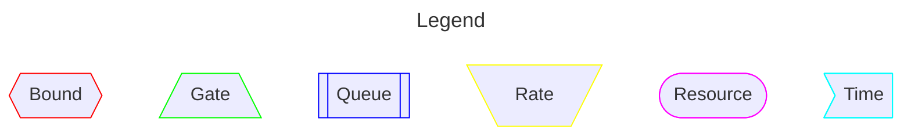

# CRE Settings

```mermaid
---
title: Legend
---
flowchart
    bound{{Bound}}
    gate[/Gate\]
    queue[[Queue]]
    rate[\Rate/]
    resource([Resource])
    time>Time]
    
    bound:::bound
    gate:::gate
    queue:::queue
    rate:::rate
    resource:::resource
    time:::time

    classDef bound stroke:#f00
    classDef gate stroke:#0f0
    classDef queue stroke:#00f
    classDef rate stroke:#ff0
    classDef resource stroke:#f0f
    classDef time stroke:#0ff
```

[//]: # (TODO subgraphs for phases/methods)

```mermaid
---
title: Limits
---
flowchart
    WorkflowExecutionConcurrencyLimit([WorkflowExecutionConcurrencyLimit]):::resource
    GatewayIncomingPayloadSizeLimit{{GatewayIncomingPayloadSizeLimit}}:::bound
    subgraph vault
        VaultCiphertextSizeLimit
        VaultIdentifierKeySizeLimit
        VaultIdentifierOwnerSizeLimit
        VaultIdentifierNamespaceSizeLimit
        VaultPluginBatchSizeLimit
        VaultRequestBatchSizeLimit
        PerOwner.VaultSecretsLimit{{PerOwner.VaultSecretsLimit}}:::bound
    end
%%    TODO unused
%%    PerOrg.ZeroBalancePruningTimeout

    PerOwner.WorkflowExecutionConcurrencyLimit([PerOwner.WorkflowExecutionConcurrencyLimit]):::resource

    PerWorkflow.TriggerEventQueueLimit[[PerWorkflow.TriggerEventQueueLimit]]:::queue
    PerWorkflow.TriggerEventQueueTimeout>PerWorkflow.TriggerEventQueueTimeout]:::time
    
    PerWorkflow.ExecutionConcurrencyLimit([PerWorkflow.ExecutionConcurrencyLimit])
    
    PerWorkflow.WASMCompressedBinarySizeLimit{{PerWorkflow.WASMCompressedBinarySizeLimit}}:::bound
    subgraph fetch
        PerWorkflow.WASMConfigSizeLimit{{PerWorkflow.WASMConfigSizeLimit}}:::bound
        PerWorkflow.WASMBinarySizeLimit{{PerWorkflow.WASMBinarySizeLimit}}:::bound
        PerWorkflow.WASMSecretsSizeLimit{{PerWorkflow.WASMSecretsSizeLimit}}:::bound
    end
    
    subgraph subscription

        PerWorkflow.TriggerSubscriptionTimeout>PerWorkflow.TriggerSubscriptionTimeout]:::time
        PerWorkflow.WASMMemoryLimit{{PerWorkflow.WASMMemoryLimit}}:::bound
        PerWorkflow.TriggerRegistrationsTimeout>PerWorkflow.TriggerRegistrationsTimeout]:::time
        PerWorkflow.TriggerSubscriptionLimit{{PerWorkflow.TriggerSubscriptionLimit}}:::bound

        subgraph triggers
            direction TB
            
            subgraph PerWorkflow.CRONTrigger
                FastestScheduleInterval>FastestScheduleInterval]:::time
            end
            subgraph PerWorkflow.HTTPTrigger
                RateLimit[\RateLimit/]:::rate
            end
            subgraph PerWorkflow.LogTrigger
                direction LR
                
                EventRateLimit[\EventRateLimit/]:::rate
                EventSizeLimit{{EventSizeLimit}}:::bound
                FilterAddressLimit{{FilterAddressLimit}}:::bound
                FilterTopicsPerSlotLimit{{FilterTopicsPerSlotLimit}}:::bound
            end
        end
    end

    subgraph execution
    
        subgraph logs
            PerWorkflow.LogLineLimit{{PerWorkflow.LogLineLimit}}:::bound
            PerWorkflow.LogEventLimit{{PerWorkflow.LogEventLimit}}:::bound
        end
        
        PerWorkflow.ExecutionTimeout>PerWorkflow.ExecutionTimeout]:::time
        
        PerWorkflow.SecretsConcurrencyLimit([PerWorkflow.SecretsConcurrencyLimit]):::resource

        PerWorkflow.ChainAllowed[/PerWorkflow.ChainAllowed\]:::gate

        PerWorkflow.CapabilityConcurrencyLimit([PerWorkflow.CapabilityConcurrencyLimit]):::resource
        PerWorkflow.CapabilityCallTimeout>PerWorkflow.CapabilityCallTimeout]:::time
       
        
        subgraph actions
            direction TB
            
            subgraph PerWorkflow.ChainWrite
                direction LR
                
                TargetsLimit{{TargetsLimit}}:::bound
                ReportSizeLimit{{ReportSizeLimit}}:::bound
    
                subgraph EVM
                    GasLimit{{GasLimit}}:::bound
                end
            end
            subgraph PerWorkflow.ChainRead
                direction LR
                chainread.CallLimit{{CallLimit}}:::bound
                LogQueryBlockLimit{{LogQueryBlockLimit}}:::bound
                PayloadSizeLimit{{PayloadSizeLimit}}:::bound
            end
            subgraph PerWorkflow.Consensus
                ObservationSizeLimit{{ObservationSizeLimit}}:::bound
                consensus.CallLimit{{CallLimit}}:::bound
            end
            subgraph PerWorkflow.HTTPAction
                direction LR
                
                httpaction.CallLimit{{CallLimit}}:::bound
                CacheAgeLimit{{CacheAgeLimit}}:::bound
                ConnectionTimeout{{ConnectionTimeout}}:::bound
                RequestSizeLimit{{RequestSizeLimit}}:::bound
                ResponseSizeLimit{{ResponseSizeLimit}}:::bound
            end
        end
    
        PerWorkflow.ExecutionResponseLimit{{PerWorkflow.ExecutionResponseLimit}}:::bound

    end

    GatewayIncomingPayloadSizeLimit-->fetch-->PerWorkflow.WASMCompressedBinarySizeLimit-->WorkflowExecutionConcurrencyLimit-->PerOwner.WorkflowExecutionConcurrencyLimit-->PerWorkflow.TriggerSubscriptionTimeout
    PerWorkflow.TriggerSubscriptionTimeout-->PerWorkflow.WASMMemoryLimit-->PerWorkflow.TriggerSubscriptionLimit-->PerWorkflow.TriggerRegistrationsTimeout-->triggers-->PerWorkflow.TriggerEventQueueLimit-->PerWorkflow.TriggerEventQueueTimeout
    PerWorkflow.TriggerEventQueueTimeout-->PerWorkflow.ExecutionConcurrencyLimit
    PerWorkflow.ExecutionConcurrencyLimit:::resource-->PerWorkflow.ExecutionTimeout-->PerWorkflow.SecretsConcurrencyLimit-->PerWorkflow.ChainAllowed-->PerWorkflow.CapabilityConcurrencyLimit-->PerWorkflow.CapabilityCallTimeout-->actions-->PerWorkflow.ExecutionResponseLimit

    classDef bound stroke:#f00
    classDef gate stroke:#0f0
    classDef queue stroke:#00f
    classDef rate stroke:#ff0
    classDef resource stroke:#f0f
    classDef time stroke:#0ff
```