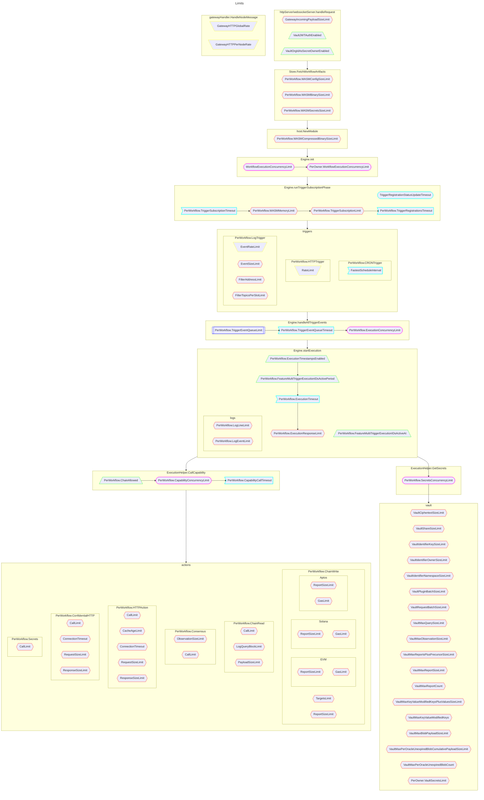

# CRE Settings

```mermaid
---
title: Legend
---
flowchart
    bound{{Bound}}
    gate[/Gate\]
    queue[[Queue]]
    rate[\Rate/]
    resource([Resource])
    time>Time]
    
    bound:::bound
    gate:::gate
    queue:::queue
    rate:::rate
    resource:::resource
    time:::time

    classDef bound stroke:#f00
    classDef gate stroke:#0f0
    classDef queue stroke:#00f
    classDef rate stroke:#ff0
    classDef resource stroke:#f0f
    classDef time stroke:#0ff
```

```mermaid
---
title: Limits
---
flowchart
    subgraph handleRequest[httpServer/websocketServer.handleRequest]
        GatewayIncomingPayloadSizeLimit{{GatewayIncomingPayloadSizeLimit}}:::bound
%%        TODO GatewayVaultManagementEnabled
        VaultJWTAuthEnabled[/VaultJWTAuthEnabled\]:::gate
        VaultOrgIdAsSecretOwnerEnabled[/VaultOrgIdAsSecretOwnerEnabled\]:::gate
    end

    subgraph HandleNodeMessage[gatewayHandler.HandleNodeMessage]
%%      DON nodes → gateway (separate from the inbound trigger flow)
        GatewayHTTPGlobalRate[\GatewayHTTPGlobalRate/]:::rate
        GatewayHTTPPerNodeRate[\GatewayHTTPPerNodeRate/]:::rate
    end
%%    WorkflowLimit - Deprecated
%%    TODO unused
%%    PerOrg.ZeroBalancePruningTimeout

    subgraph Store.FetchWorkflowArtifacts
        PerWorkflow.WASMConfigSizeLimit{{PerWorkflow.WASMConfigSizeLimit}}:::bound
        PerWorkflow.WASMBinarySizeLimit{{PerWorkflow.WASMBinarySizeLimit}}:::bound
        PerWorkflow.WASMSecretsSizeLimit{{PerWorkflow.WASMSecretsSizeLimit}}:::bound
    end

    subgraph host.NewModule
        PerWorkflow.WASMCompressedBinarySizeLimit{{PerWorkflow.WASMCompressedBinarySizeLimit}}:::bound
    end
    
    subgraph Engine.init
        WorkflowExecutionConcurrencyLimit([WorkflowExecutionConcurrencyLimit]):::resource
        PerOwner.WorkflowExecutionConcurrencyLimit([PerOwner.WorkflowExecutionConcurrencyLimit]):::resource

        WorkflowExecutionConcurrencyLimit-->PerOwner.WorkflowExecutionConcurrencyLimit
    end
    
    subgraph Engine.runTriggerSubscriptionPhase
        TriggerRegistrationStatusUpdateTimeout([TriggerRegistrationStatusUpdateTimeout]):::time
        PerWorkflow.TriggerSubscriptionTimeout>PerWorkflow.TriggerSubscriptionTimeout]:::time
        PerWorkflow.WASMMemoryLimit{{PerWorkflow.WASMMemoryLimit}}:::bound
        PerWorkflow.TriggerRegistrationsTimeout>PerWorkflow.TriggerRegistrationsTimeout]:::time
        PerWorkflow.TriggerSubscriptionLimit{{PerWorkflow.TriggerSubscriptionLimit}}:::bound
        
        PerWorkflow.TriggerSubscriptionTimeout-->PerWorkflow.WASMMemoryLimit-->PerWorkflow.TriggerSubscriptionLimit-->PerWorkflow.TriggerRegistrationsTimeout
    end

    subgraph triggers
        direction TB

        subgraph PerWorkflow.CRONTrigger
            PerWorkflow.CRONTrigger.FastestScheduleInterval>FastestScheduleInterval]:::time
        end
        subgraph PerWorkflow.HTTPTrigger
            PerWorkflow.HTTPTrigger.RateLimit[\RateLimit/]:::rate
        end
        subgraph PerWorkflow.LogTrigger
            direction LR

            PerWorkflow.LogTrigger.EventRateLimit[\EventRateLimit/]:::rate
            PerWorkflow.LogTrigger.EventSizeLimit{{EventSizeLimit}}:::bound
            PerWorkflow.LogTrigger.FilterAddressLimit{{FilterAddressLimit}}:::bound
            PerWorkflow.LogTrigger.FilterTopicsPerSlotLimit{{FilterTopicsPerSlotLimit}}:::bound
        end
    end

    subgraph Engine.handleAllTriggerEvents
        PerWorkflow.TriggerEventQueueLimit[[PerWorkflow.TriggerEventQueueLimit]]:::queue
        PerWorkflow.TriggerEventQueueTimeout>PerWorkflow.TriggerEventQueueTimeout]:::time
        PerWorkflow.ExecutionConcurrencyLimit([PerWorkflow.ExecutionConcurrencyLimit]):::resource

        PerWorkflow.TriggerEventQueueLimit-->PerWorkflow.TriggerEventQueueTimeout-->PerWorkflow.ExecutionConcurrencyLimit
    end

    subgraph Engine.startExecution
        direction TB
    
        subgraph logs
            PerWorkflow.LogLineLimit{{PerWorkflow.LogLineLimit}}:::bound
            PerWorkflow.LogEventLimit{{PerWorkflow.LogEventLimit}}:::bound
        end
        
        PerWorkflow.ExecutionTimeout>PerWorkflow.ExecutionTimeout]:::time
        PerWorkflow.ExecutionResponseLimit{{PerWorkflow.ExecutionResponseLimit}}:::bound
        PerWorkflow.ExecutionTimestampsEnabled[/PerWorkflow.ExecutionTimestampsEnabled\]:::gate
        PerWorkflow.FeatureMultiTriggerExecutionIDsActiveAt[/PerWorkflow.FeatureMultiTriggerExecutionIDsActiveAt\]:::gate
        PerWorkflow.FeatureMultiTriggerExecutionIDsActivePeriod[/PerWorkflow.FeatureMultiTriggerExecutionIDsActivePeriod\]:::gate

        PerWorkflow.ExecutionTimestampsEnabled-->PerWorkflow.FeatureMultiTriggerExecutionIDsActivePeriod-->PerWorkflow.ExecutionTimeout-->PerWorkflow.ExecutionResponseLimit
    end
        
    subgraph ExecutionHelper.GetSecrets
        PerWorkflow.SecretsConcurrencyLimit([PerWorkflow.SecretsConcurrencyLimit]):::resource
    end
    subgraph ExecutionHelper.CallCapability
        PerWorkflow.ChainAllowed[/PerWorkflow.ChainAllowed\]:::gate
        PerWorkflow.CapabilityConcurrencyLimit([PerWorkflow.CapabilityConcurrencyLimit]):::resource
        PerWorkflow.CapabilityCallTimeout>PerWorkflow.CapabilityCallTimeout]:::time
        
        PerWorkflow.ChainAllowed-->PerWorkflow.CapabilityConcurrencyLimit-->PerWorkflow.CapabilityCallTimeout
    end
    
    subgraph actions
        direction TB
        
        subgraph PerWorkflow.ChainWrite
            direction LR

            PerWorkflow.ChainWrite.TargetsLimit{{TargetsLimit}}:::bound
            PerWorkflow.ChainWrite.ReportSizeLimit{{ReportSizeLimit}}:::bound

            subgraph EVM
                PerWorkflow.ChainWrite.EVM.ReportSizeLimit{{ReportSizeLimit}}:::bound
                PerWorkflow.ChainWrite.EVM.GasLimit{{GasLimit}}:::bound
%%                PerWorkflow.ChainWrite.EVM.TransactionGasLimit - Deprecated
            end
            subgraph Solana
                PerWorkflow.ChainWrite.Solana.ReportSizeLimit{{ReportSizeLimit}}:::bound
                PerWorkflow.ChainWrite.Solana.GasLimit{{GasLimit}}:::bound
            end
            subgraph Aptos
                PerWorkflow.ChainWrite.Aptos.ReportSizeLimit{{ReportSizeLimit}}:::bound
                PerWorkflow.ChainWrite.Aptos.GasLimit{{GasLimit}}:::bound
            end
        end
        subgraph PerWorkflow.ChainRead
            direction LR
            PerWorkflow.ChainRead.CallLimit{{CallLimit}}:::bound
            PerWorkflow.ChainRead.LogQueryBlockLimit{{LogQueryBlockLimit}}:::bound
            PerWorkflow.ChainRead.PayloadSizeLimit{{PayloadSizeLimit}}:::bound
        end
        subgraph PerWorkflow.Consensus
            PerWorkflow.Consensus.ObservationSizeLimit{{ObservationSizeLimit}}:::bound
            PerWorkflow.Consensus.CallLimit{{CallLimit}}:::bound
        end
        subgraph PerWorkflow.HTTPAction
            direction LR

            PerWorkflow.HTTPAction.CallLimit{{CallLimit}}:::bound
            PerWorkflow.HTTPAction.CacheAgeLimit{{CacheAgeLimit}}:::bound
            PerWorkflow.HTTPAction.ConnectionTimeout{{ConnectionTimeout}}:::bound
            PerWorkflow.HTTPAction.RequestSizeLimit{{RequestSizeLimit}}:::bound
            PerWorkflow.HTTPAction.ResponseSizeLimit{{ResponseSizeLimit}}:::bound
        end
        subgraph PerWorkflow.ConfidentialHTTP
            direction LR

            PerWorkflow.ConfidentialHTTP.CallLimit{{CallLimit}}:::bound
            PerWorkflow.ConfidentialHTTP.ConnectionTimeout{{ConnectionTimeout}}:::bound
            PerWorkflow.ConfidentialHTTP.RequestSizeLimit{{RequestSizeLimit}}:::bound
            PerWorkflow.ConfidentialHTTP.ResponseSizeLimit{{ResponseSizeLimit}}:::bound
        end
        subgraph PerWorkflow.Secrets
            PerWorkflow.Secrets.CallLimit{{CallLimit}}:::bound
        end
    end
    subgraph vault
        VaultCiphertextSizeLimit{{VaultCiphertextSizeLimit}}:::bound
        VaultShareSizeLimit{{VaultShareSizeLimit}}:::bound
        VaultIdentifierKeySizeLimit{{VaultIdentifierKeySizeLimit}}:::bound
        VaultIdentifierOwnerSizeLimit{{VaultIdentifierOwnerSizeLimit}}:::bound
        VaultIdentifierNamespaceSizeLimit{{VaultIdentifierNamespaceSizeLimit}}:::bound
        VaultPluginBatchSizeLimit{{VaultPluginBatchSizeLimit}}:::bound
        VaultRequestBatchSizeLimit{{VaultRequestBatchSizeLimit}}:::bound
        VaultMaxQuerySizeLimit{{VaultMaxQuerySizeLimit}}:::bound
        VaultMaxObservationSizeLimit{{VaultMaxObservationSizeLimit}}:::bound
        VaultMaxReportsPlusPrecursorSizeLimit{{VaultMaxReportsPlusPrecursorSizeLimit}}:::bound
        VaultMaxReportSizeLimit{{VaultMaxReportSizeLimit}}:::bound
        VaultMaxReportCount{{VaultMaxReportCount}}:::bound
        VaultMaxKeyValueModifiedKeysPlusValuesSizeLimit{{VaultMaxKeyValueModifiedKeysPlusValuesSizeLimit}}:::bound
        VaultMaxKeyValueModifiedKeys{{VaultMaxKeyValueModifiedKeys}}:::bound
        VaultMaxBlobPayloadSizeLimit{{VaultMaxBlobPayloadSizeLimit}}:::bound
        VaultMaxPerOracleUnexpiredBlobCumulativePayloadSizeLimit{{VaultMaxPerOracleUnexpiredBlobCumulativePayloadSizeLimit}}:::bound
        VaultMaxPerOracleUnexpiredBlobCount{{VaultMaxPerOracleUnexpiredBlobCount}}:::bound
        PerOwner.VaultSecretsLimit{{PerOwner.VaultSecretsLimit}}:::bound
    end

    handleRequest-->Store.FetchWorkflowArtifacts-->host.NewModule-->Engine.init-->Engine.runTriggerSubscriptionPhase-->triggers-->Engine.handleAllTriggerEvents-->Engine.startExecution
    Engine.startExecution-->ExecutionHelper.CallCapability-->actions
    Engine.startExecution-->PerWorkflow.SecretsConcurrencyLimit-->vault

%%  DON nodes → gateway is a separate entry point, not connected to the trigger/execution chain above
    HandleNodeMessage

    classDef bound stroke:#f00
    classDef gate stroke:#0f0
    classDef queue stroke:#00f
    classDef rate stroke:#ff0
    classDef resource stroke:#f0f
    classDef time stroke:#0ff
```
