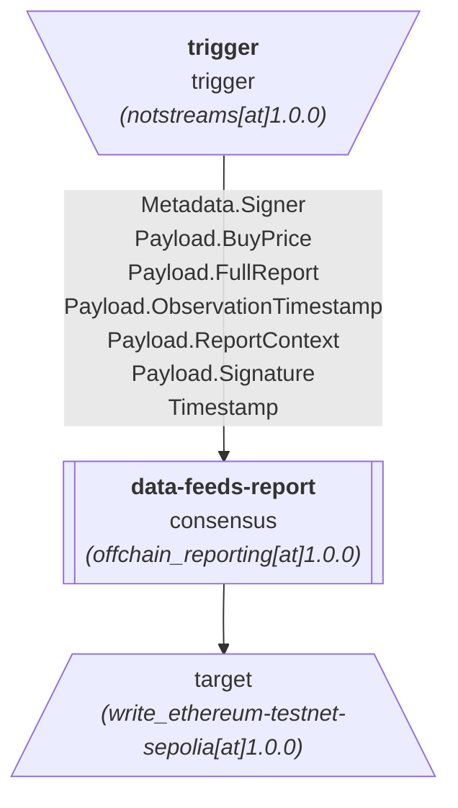

```mermaid
flowchart

	trigger[\"<b>trigger</b><br>trigger<br><i>(notstreams[at]1.0.0)</i>"/]
	
	data-feeds-report[["<b>data-feeds-report</b><br>consensus<br><i>(offchain_reporting[at]1.0.0)</i>"]]
	trigger -- Metadata.Signer<br>Payload.BuyPrice<br>Payload.FullReport<br>Payload.ObservationTimestamp<br>Payload.ReportContext<br>Payload.Signature<br>Timestamp --> data-feeds-report 
			
	unnamed2[/"target<br><i>(write_ethereum-testnet-sepolia[at]1.0.0)</i>"\]
	data-feeds-report --> unnamed2
			
```