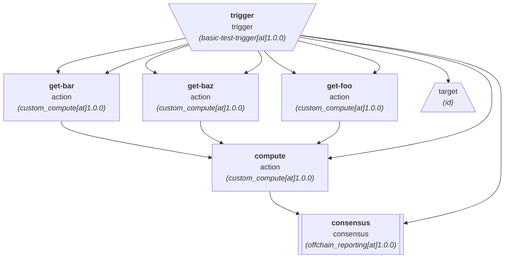

```mermaid
flowchart

	trigger[\"<b>trigger</b><br>trigger<br><i>(basic-test-trigger[at]1.0.0)</i>"/]
	
	compute["<b>compute</b><br>action<br><i>(custom_compute[at]1.0.0)</i>"]
	get-bar --> compute
		get-baz --> compute
		get-foo --> compute
		trigger --> compute
		
	get-bar["<b>get-bar</b><br>action<br><i>(custom_compute[at]1.0.0)</i>"]
	trigger --> get-bar
		trigger --> get-bar
		
	get-baz["<b>get-baz</b><br>action<br><i>(custom_compute[at]1.0.0)</i>"]
	trigger --> get-baz
		trigger --> get-baz
		
	get-foo["<b>get-foo</b><br>action<br><i>(custom_compute[at]1.0.0)</i>"]
	trigger --> get-foo
		trigger --> get-foo
		
	consensus[["<b>consensus</b><br>consensus<br><i>(offchain_reporting[at]1.0.0)</i>"]]
	compute --> consensus
		trigger --> consensus
		
	unnamed6[/"target<br><i>(id)</i>"\]
	trigger --> unnamed6
		
```