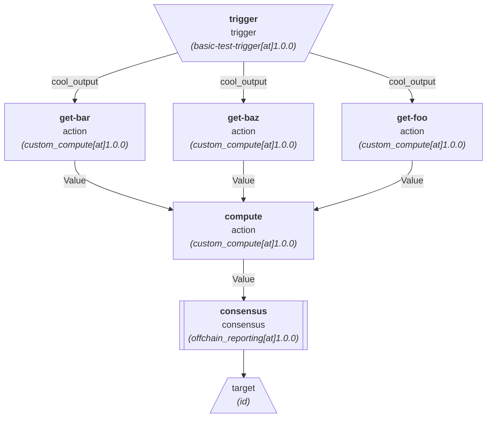

```mermaid
flowchart

	trigger[\"<b>trigger</b><br>trigger<br><i>(basic-test-trigger[at]1.0.0)</i>"/]
	
	compute["<b>compute</b><br>action<br><i>(custom_compute[at]1.0.0)</i>"]
	get-bar -- Value --> compute 
			get-baz -- Value --> compute 
			get-foo -- Value --> compute 
			
	get-bar["<b>get-bar</b><br>action<br><i>(custom_compute[at]1.0.0)</i>"]
	trigger -- cool_output --> get-bar 
			
	get-baz["<b>get-baz</b><br>action<br><i>(custom_compute[at]1.0.0)</i>"]
	trigger -- cool_output --> get-baz 
			
	get-foo["<b>get-foo</b><br>action<br><i>(custom_compute[at]1.0.0)</i>"]
	trigger -- cool_output --> get-foo 
			
	consensus[["<b>consensus</b><br>consensus<br><i>(offchain_reporting[at]1.0.0)</i>"]]
	compute -- Value --> consensus 
			
	unnamed6[/"target<br><i>(id)</i>"\]
	consensus --> unnamed6
			
```