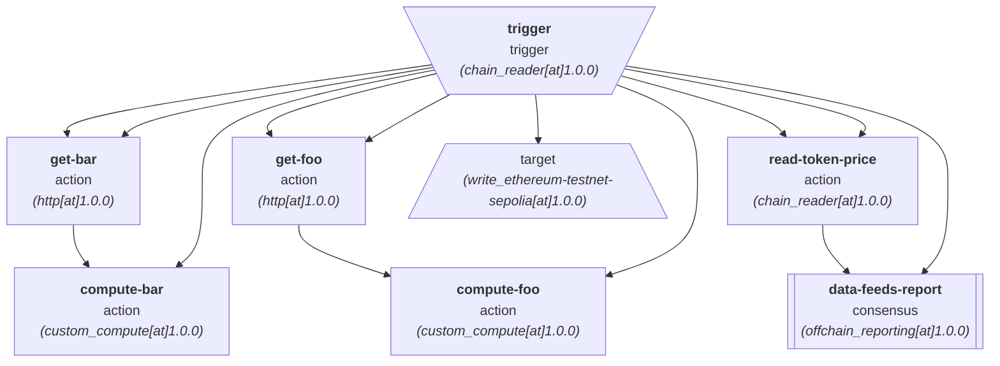

```mermaid
flowchart

	trigger[\"<b>trigger</b><br>trigger<br><i>(chain_reader[at]1.0.0)</i>"/]
	
	compute-bar["<b>compute-bar</b><br>action<br><i>(custom_compute[at]1.0.0)</i>"]
	get-bar --> compute-bar
		trigger --> compute-bar
		
	compute-foo["<b>compute-foo</b><br>action<br><i>(custom_compute[at]1.0.0)</i>"]
	get-foo --> compute-foo
		trigger --> compute-foo
		
	get-bar["<b>get-bar</b><br>action<br><i>(http[at]1.0.0)</i>"]
	trigger --> get-bar
		trigger --> get-bar
		
	get-foo["<b>get-foo</b><br>action<br><i>(http[at]1.0.0)</i>"]
	trigger --> get-foo
		trigger --> get-foo
		
	read-token-price["<b>read-token-price</b><br>action<br><i>(chain_reader[at]1.0.0)</i>"]
	trigger --> read-token-price
		trigger --> read-token-price
		
	data-feeds-report[["<b>data-feeds-report</b><br>consensus<br><i>(offchain_reporting[at]1.0.0)</i>"]]
	read-token-price --> data-feeds-report
		trigger --> data-feeds-report
		
	unnamed7[/"target<br><i>(write_ethereum-testnet-sepolia[at]1.0.0)</i>"\]
	trigger --> unnamed7
		
```