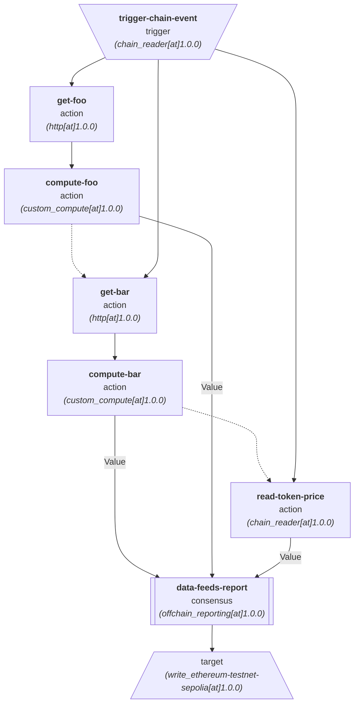

```mermaid
flowchart

	trigger-chain-event[\"<b>trigger-chain-event</b><br>trigger<br><i>(chain_reader[at]1.0.0)</i>"/]
	
	compute-bar["<b>compute-bar</b><br>action<br><i>(custom_compute[at]1.0.0)</i>"]
	get-bar --> compute-bar
			
	compute-foo["<b>compute-foo</b><br>action<br><i>(custom_compute[at]1.0.0)</i>"]
	get-foo --> compute-foo
			
	get-bar["<b>get-bar</b><br>action<br><i>(http[at]1.0.0)</i>"]
	compute-foo -..-> get-bar
	trigger-chain-event --> get-bar
			
	get-foo["<b>get-foo</b><br>action<br><i>(http[at]1.0.0)</i>"]
	trigger-chain-event --> get-foo
			
	read-token-price["<b>read-token-price</b><br>action<br><i>(chain_reader[at]1.0.0)</i>"]
	compute-bar -..-> read-token-price
	trigger-chain-event --> read-token-price
			
	data-feeds-report[["<b>data-feeds-report</b><br>consensus<br><i>(offchain_reporting[at]1.0.0)</i>"]]
	compute-bar -- Value --> data-feeds-report 
			compute-foo -- Value --> data-feeds-report 
			read-token-price -- Value --> data-feeds-report 
			
	unnamed7[/"target<br><i>(write_ethereum-testnet-sepolia[at]1.0.0)</i>"\]
	data-feeds-report --> unnamed7
			
```