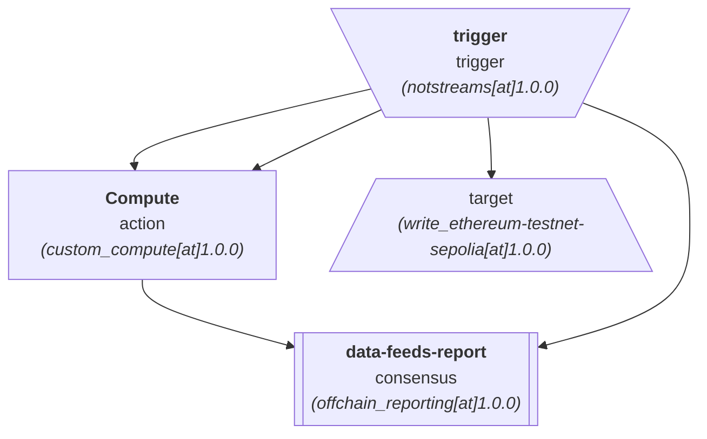

```mermaid
flowchart

	trigger[\"<b>trigger</b><br>trigger<br><i>(notstreams[at]1.0.0)</i>"/]
	
	Compute["<b>Compute</b><br>action<br><i>(custom_compute[at]1.0.0)</i>"]
	trigger --> Compute
		trigger --> Compute
		
	data-feeds-report[["<b>data-feeds-report</b><br>consensus<br><i>(offchain_reporting[at]1.0.0)</i>"]]
	Compute --> data-feeds-report
		trigger --> data-feeds-report
		
	unnamed3[/"target<br><i>(write_ethereum-testnet-sepolia[at]1.0.0)</i>"\]
	trigger --> unnamed3
		
```